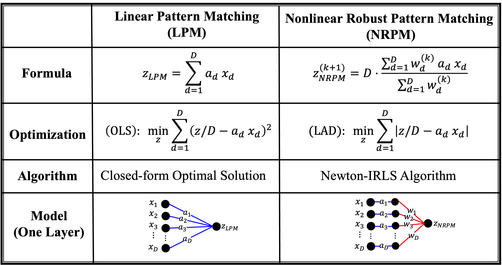
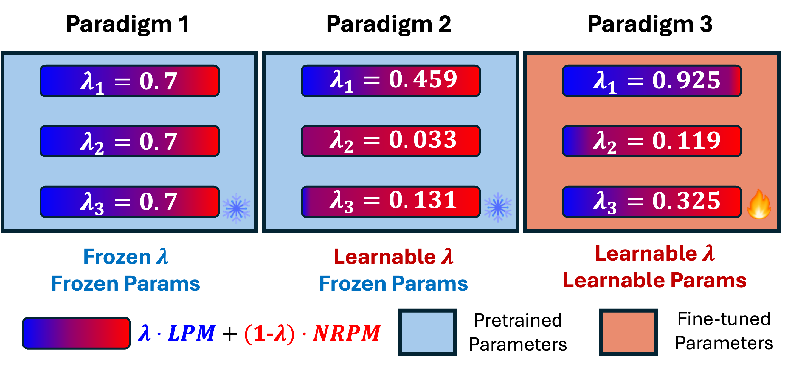

# Robustness Reprogramming for Representation Learning

This repository provides the code, data, and results for the paper: Robustness Reprogramming for Representation Learning [[arXiv](https://arxiv.org/abs/2410.04577)].


This work tackles an intriguing and fundamental open challenge in representation learning: Given a well-trained deep learning model, can it be reprogrammed to enhance its robustness against adversarial or noisy input perturbations without altering its parameters? To explore this, we revisit the core feature transformation mechanism in representation learning and propose a novel non-linear robust pattern matching technique as a robust alternative. Furthermore, we introduce three model reprogramming paradigms to offer flexible control of robustness under different efficiency requirements. Comprehensive experiments and ablation studies across diverse learning models ranging from basic linear model and MLPs to shallow and modern deep ConvNets demonstrate the effectiveness of our approaches. This work not only opens a promising and orthogonal direction for improving adversarial defenses in deep learning beyond existing methods but also provides new insights into designing more resilient AI systems with robust statistics.

## Vanilla Linear Pattern Matching (LPM) vs. Nonlinear Robust Pattern Matching (NRPM).


## ROBUSTNESS REPROGRAMMING via 3 Paradigms


### Paradigm 1: without fine-tuning, good robustness with zero cost.

### Paradigm 2: only fine-tuning {λ}, strong robustness with slight cost

### Paradigm 3: overall fine-tuning, superior robustness with acceptable cost.


## ROBUSTNESS REPROGRAMMING on MLPs

```bash
python mnist_mlp.py
```

## ROBUSTNESS REPROGRAMMING on Convolutions

```bash
python mnist_lenet.py
```

## ROBUSTNESS REPROGRAMMING on ResNets

```bash
python train_cifar10_resnet.py # training
python test_cifar10_resnet.py # testing
```


## Citation

If you find our work helpful, please consider citing it as
```
@misc{hou2024robustnessreprogrammingrepresentationlearning,
      title={Robustness Reprogramming for Representation Learning}, 
      author={Zhichao Hou and MohamadAli Torkamani and Hamid Krim and Xiaorui Liu},
      year={2024},
      eprint={2410.04577},
      archivePrefix={arXiv},
      primaryClass={cs.LG},
      url={https://arxiv.org/abs/2410.04577}, 
}
```


